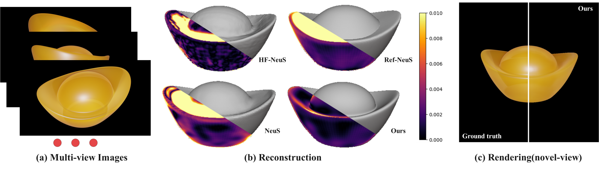

# NeuralTO



Implementation of paper *NeuralTO: Neural Reconstruction and View Synthesis of Translucent Objects*(TOG' 24) using [Jittor](https://github.com/Jittor/JNeRF) framework.

**NOTE: This repository is still incomplete and needs further update**

# Environment Setup

Please check the official JNeRF environment requirements before running our project and follow the installation command to set up a Jittor environment.

**This code only tested on version Jittor1.3.5, Ubuntu20.04, Cuda12.4**

**NOTE: We meet a memory leaking bug in the newest version Jittor:1.3.8.5, try a lower version if you have the same problem**

```bash
conda create -n JNeuralTO python=3.7
conda activate JNeuralTO
cd /path/of/our/project
cd JNeRF
python -m pip install --user -e .
```

Installing cupy for JNeuS
```bash
# for CUDA-11.3, run: 
pip install cupy-cuda113
```

# Configuration Setup

We provide an example config file for reconstruction stage: `JNeRF/projects/neuralto/configs/syn_gummybear_womask.py` 
and an example config file for rendering stage: `JNeRF/projects/neuralto/configs/syn_gummybear_sss.py`
The detailed explanation of these parameters can be found in these files.

Our synthesis dataset can be downloaded from: [OneDrive url](https://1drv.ms/f/c/20a93f3338af3e61/EopYJfbUPcFNk9WsRaN4HXkBdzG-ndPMd7JsCdI-gX-tjA?e=Aq59gV)
We provide the mesh in of the objects used in our paper `gt_mesh` file. Note that "dragon2.obj" is the model of "ancient dragon" in our paper.

The structure of our dataset likes the following directory:
```txt
|- gummybear
|  |- mask
|     |- 0000.png
|     |- 0001.png
|     |- ...
|  |- train
|     |- 0000.png
|     |- 0001.png
|     |- ...
|  |- test
|     |- 0000.png
|     |- 0001.png
|     |- ...
|  |- transforms_train.json
|  |- transforms_val.json
|
|- ...
```
Before running the code, please ensure that you have properly organized the dataset and configured the `.conf` files

[ ] TODO: Release the real data and dataset code for COLMAP dataset

# Running

- For reconstruction in Stage1, run the command below.
It takes about 5h in one NVIDIA 3090 GPU using the example config file.

```shell
python tools/run_net.py \
       --config-file ./projects/neuralto/configs/syn_gummybear_womask.py \
       --type neuralTO_recon \
       --task train
```

- You can extract mesh using this command. Make sure that you have set a proper bounding box for the model. By default, we use 
`object_bbox_min=[-1.21, -1.21, -1.21]` and `object_bbox_max=[1.21, 1.21, 1.21]`
```shell
python tools/run_net.py \
       --config-file ./projects/neuralto/configs/syn_gummybear_womask.py \
       --type neuralTO_recon \
       --task validate_mesh
```

- For learning scattering property in Stage2, we rely on the reconstructed geometry.
If all things are done, run the command below:

```shell
python tools/run_net.py \
       --config-file ./projects/neuralto/configs/syn_gummybear_sss.py \
       --type neuralTO_render \
       --task train
```

# Citation

If you find our method helpful for your work, please consider to cite: 

```txt
@article{cai2024neuralto,
  title={NeuralTO: Neural Reconstruction and View Synthesis of Translucent Objects},
  author={Cai, Yuxiang and Qiu, Jiaxiong and Li, Zhong and Ren, Bo},
  journal={ACM Transactions on Graphics (TOG)},
  volume={43},
  number={4},
  pages={1--14},
  year={2024},
  publisher={ACM New York, NY, USA}
}
```